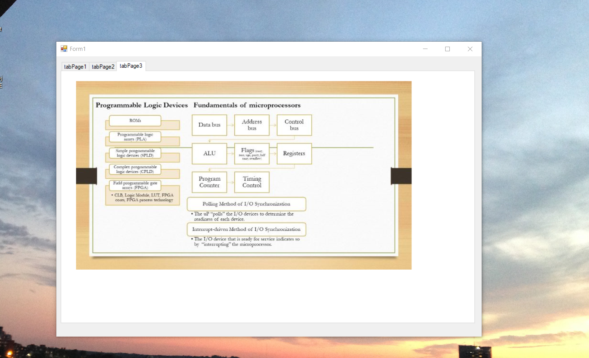
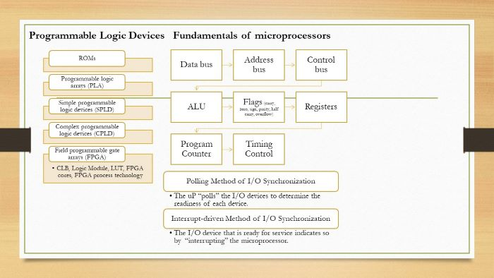
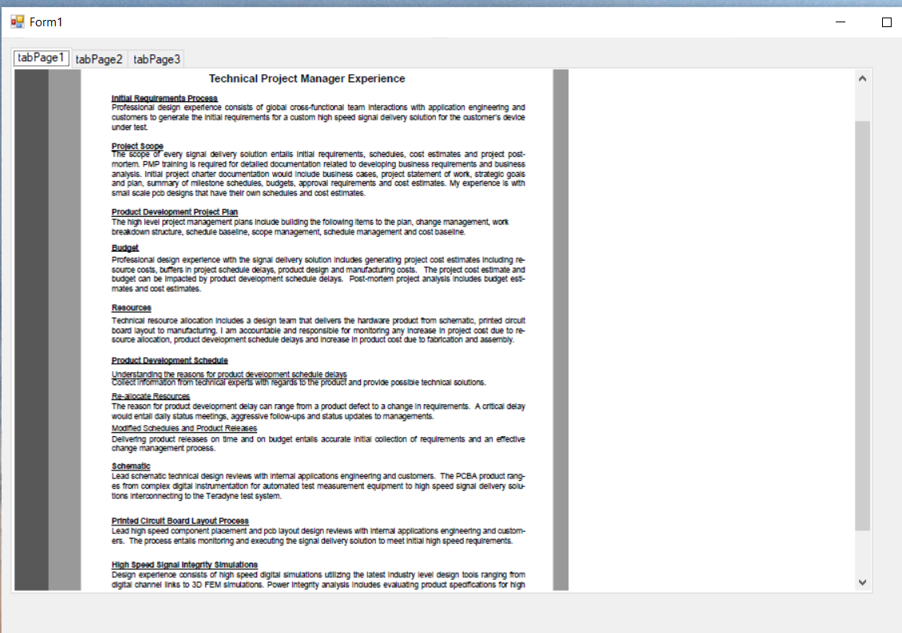

# Fundamentals Computer Engineering

The project provides an overview of Fundamentals of Computer Engineering 

Confidential information is not displayed.

Please download the executable in https://github.com/alpaddesai/FundamentalsComputerEngineering/releases  for details.

Images are custom.

## Fundamentals of Computer Engineering

## Basic digital circuits and microprocessor

## Technical Project Management

Please reference https://github.com/alpaddesai/IntroductionToMachineLanguageProgramming , https://github.com/alpaddesai/DigitalLogicHDL
